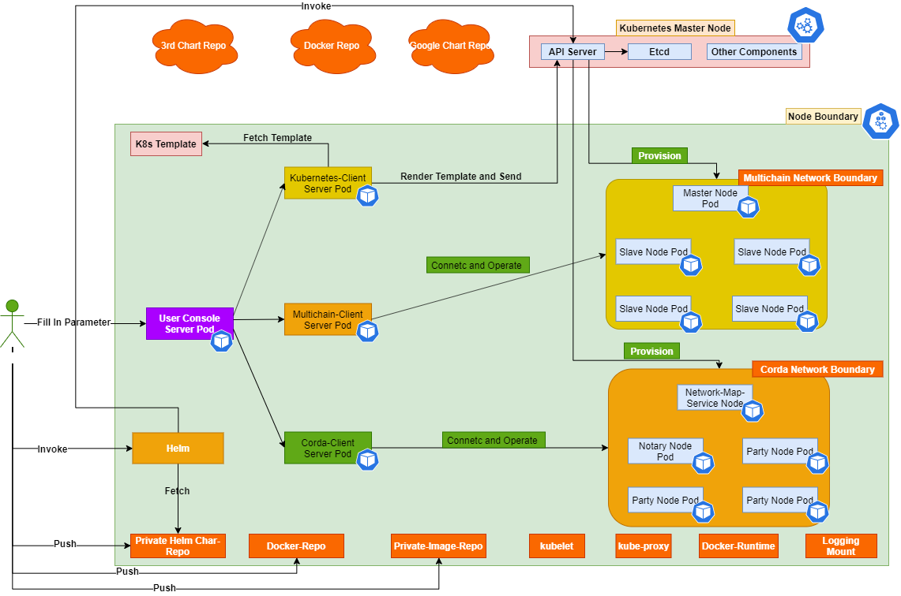

## Welcome to MLBaaSPlatfrom
> A simple platform based on docker &amp; Kubernetes to setup block system (currently for multichain and corda system and also hyperledger fabric).

### Introduction
> This Simple Platform consists of below sub-projects:

```markdown
BaasFrontConsole
<https://github.com/menglong567/BaasFrontConsole>

KubernetesClient
<https://github.com/menglong567/KubernetesClient>

MultichainClient
<https://github.com/menglong567/MultichainClient>

CordaClient
<https://github.com/menglong567/CordaClient.git>

multichain-docker-kubernetes
<https://github.com/menglong567/multichain-docker-kubernetes>

corda-docker-kubernetes
<https://github.com/menglong567/corda-docker-kubernetes.git>

MultiChainJavaAPI
<https://github.com/menglong567/MultiChainJavaAPI>

kubernetes-client/java
<https://github.com/kubernetes-client/java>

MLBaaSHelmChart
<https://github.com/menglong567/MLBaaSHelmChart>

HyperledgerFabricClient
<https://github.com/menglong567/HyperledgerFabricClient>

Besides the above projects you also need to be familiar with multichain which is an opensource blockchain
(It also provides commercial version starting from 2.x version) <https://www.multichain.com/> and corda system <https://www.corda.net/> or hyperledger fabric

Current the whole BaaS system is still in developing status and for front-end server you can build on your own 
based on the api from MultichainClient project and KubernetesClient and also cordaClient using whatever frameworks you like or you can use 
the Demo web console I developed which you can get the demo code from <https://github.com/menglong567/BaasFrontConsole> which is still under development and currently only multichain integrated

For helm chart please refer to <https://github.com/menglong567/MLBaaSHelmChart>
```
# Purpose of the BaaS System
Without BaaS system there're much more details you need to consider if you want to deploy blockchain networks to docker or even kubernetes for any blockchain product.

This simple platform provides the ability to deploy blockchain network to kubernetes for multichain and corda & Hyperledger fabric

# Architecture
> Here i'm giving the whole picture of this simple project as below



# How to get started
> Please refer to <https://github.com/menglong567/BaasFrontConsole>

# Support or Contact
> If you have question please contact me via menglong567@aliyun.com